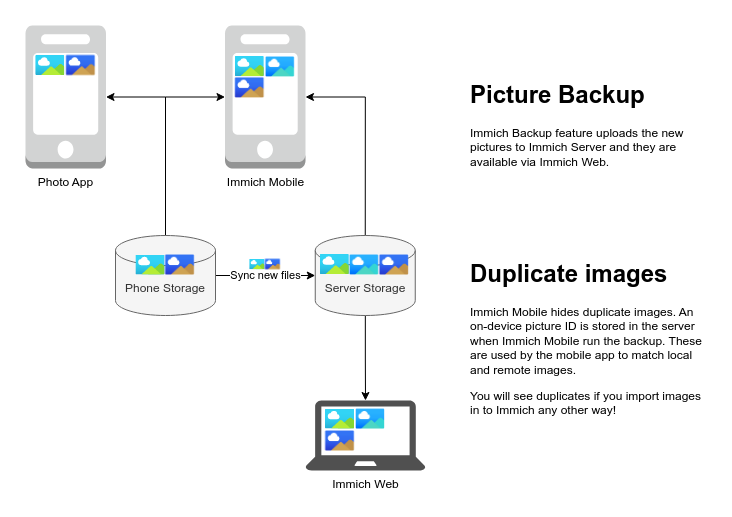

# Why?

Immich Mobile blends local images on the phone together with remote images on the server. The app does this really well and this is one of the great features with Immich. Immich synchronization logic is by design simple, one way and based around the idea of backup, this causes problems for my workflow. Let me illustrate it with a few pictures.

It's really cool that I have my full picture archive available in the Immich Mobile application. I can browse images for over a decade with ease and speed. All these images would never fit on my phone.

Immich uploads the new pictures to the server and they are available everywhere. All good, now let me introduce you to two scenarios that causes problems for me.

The Image backup solution only synchronizes new images, removed images are ignored. If you consider this an backup (like Immich do) it makes sense to keep the images server side. At the same time the Immich Mobile application allows me to remove images at the server so the backup is not really a backup.

I'm happy to use the Immich Mobile application to browse my archive, but for local image viewing I prefer to stay flexible. I can use Immich Mobile for "the full picture" view, and the phones normal photo application to look at recently taken pictures. Immich Mobile do not support all features that I use so I prefer to use the best app for the job and not limit myself to Immich for my photo viewing.

I also hope that I will be able to use Immich with my girlfriend to share pictures and I quite certain that I will never convince her to replace her photo application. But she it happy to use a special app like Immich for photo sharing with me.

The above scenario would be quickly annoying, I considered to only "backup" the images at night. That allowed me some time to remove bad pictures locally on the phone before they where uploaded. This had the drawback that it was impossible for me to share images with my girlfriend the same day, and I would still be forced to remove images twice (or from Immich Mobile only) for older pictures.

Immich also has a nice web UI that you can use to browse pictures stored at the server. I like to use my big monitor to view pictures, organize them and clean up and delete bad pictures. The problem is that this only removed pictures on the server.

This is really the same problem as scenario 1, my changes are not reflected on the other device. Immich has no mechanism to sync changed back to the phone and I do not expect that to change.

I'm sure Immich workflow works for you if you exclusively use Immich Mobile for all your photo needs and I'm sure that they are plenty of people out there that do, I'm not one of them. So this repository was born with a design like this:

I have replaced Immich backups with [Syncthing](https://syncthing.net/), a dedicated well proven synchronization service. You can configure it's behavior as you like, I have setup a simple two way sync where I synchronize both new/changed pictures, as well as deletions.

Immich Tools will communicate with Syncthing & Immich to add/remove pictures to Immich Server and/or Syncthing. Syncthing will synchronize changes back to the phone. Pictures added to Immich Server will not be synchronized back to the phone (there is not enough space for that), but deletions will!

**You are free to**:

* Use any application to browse your local pictures on your phone. Delete or organize pictures as you like, any time.
* You are free to use any desktop software to manipulate the data in the Syncthing folder.
* You can organize and delete pictures in Immich Web and the changes will synchronize back to the phone.

I have also added real backups to the Syncthing folder, in case I need to restore something that was deleted.

**Drawbacks**:

* Immich Mobile will show duplicate images, the easiest solution was tell Immich Mobile to only show remote images. You have to trick the app to do that at the moment. Immich Mobile shows local images from the folders you have selected to backup. Select an almost empty folder and ignore the one random image.
* Pictures will not appear in Immich Mobile until after Syncthing has synchronized the file.
